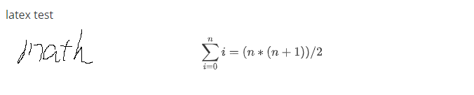

### Test1


#### code test

```c
#include <stdio.h>

int main(int argc, char *argv[])
{
    printf("hello!");
    return 0;
}
```


#### math test

math~t~  test^t^ 
$$
\sum_{i=0}^n i = (n*(n+1)) /2
$$


#### image test




2020-10-01-Test1

